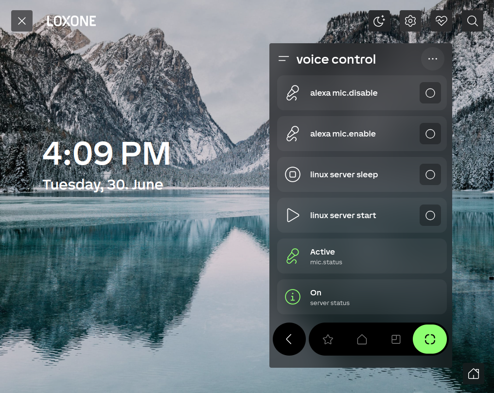
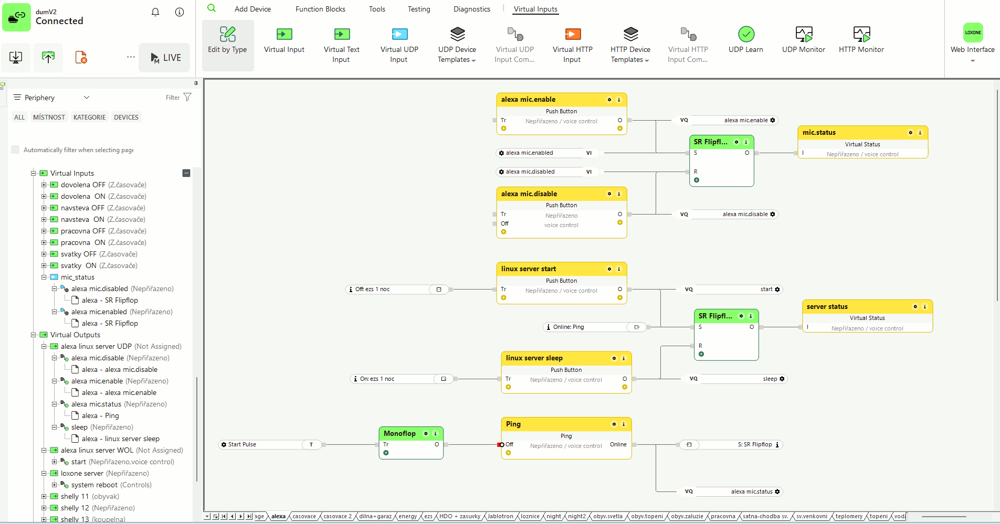
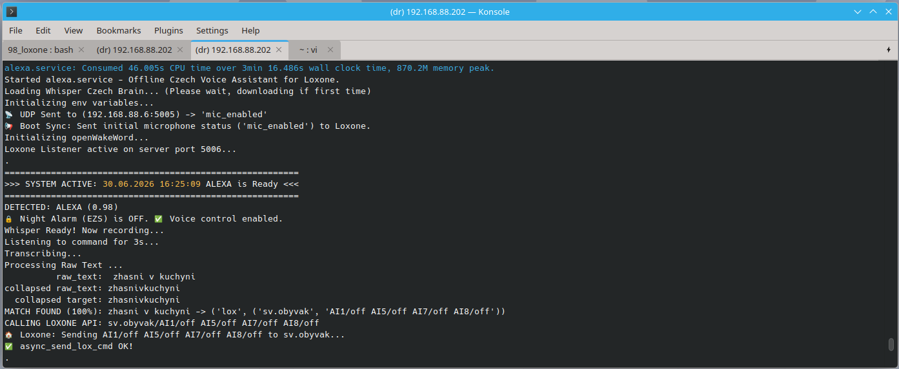

# Český hlasový asistent pro Loxone Miniserver & LG TV
Autonomní hlasový asistent navržený pro nepřetržitý provoz (24/7) v češtině, který umožňuje plné ovládání Loxone Miniserveru a LG Smart TV bez závislosti na internetovém připojení a bez nutnosti integrace do robustních platforem jako je Home Assistant. Systém poskytuje absolutní svobodu v ovládání libovolných vstupů/výstupů funkčních bloků v Loxone. Uživatel si může pro každou akci definovat libovolné klíčové fráze v přirozené češtině, včetně podpory více různých výrazů pro stejný povel.

# Czech Voice Assistant for Loxone Miniserver & LG TV
A fully offline, privacy-first Python voice assistant engineered for 24/7 local smart home deployment. This system enables direct control over Loxone Miniserver states and LG webOS Smart TVs without cloud dependencies or complex middle-layer integrations like Home Assistant. It provides granular execution mapping across any operational Loxone functional block input/output. Users can provision highly custom voice trigger phrases using natural Czech syntax, supporting multiple lexical variations mapped directly to the same hardware command array.

## 📱 Interface & Real-Time Monitoring

### 1. Loxone App Frontend Dashboard



### 2. Embedded Low-Level Automation Logic (Loxone Config)
The automation grid uses asynchronous network pings, startup pulse initializers, and RS-Flip-Flops to store system power and microphone registration values without persistent storage reliance.



### 3. Server Initialization & Intent Parsing Logs
The Python backend engine manages active system configuration loops, outputs colorized terminal state frames, and parses natural-language voice inputs down to explicit REST API target blocks dynamically.



## 🚀 Key Features:
* **Any Loxone Function:** Universal Loxone Mapping across any functional block input/output.
* **Any Voice Command for Function:** Map customized natural language voice commands to any hardware target.
* **More Voice Commands for same Function:** Bind multiple voice phrases to trigger the exact same action.
* **Fully Offline:** Core command processing and wake-word detection operate completely locally and offline.
* **Two-Stage Local Wake-Word Verification:** Combines lightweight ONNX candidate detection with localized `Faster-Whisper` verification in RAM for zero false positives and sub-100ms response times without cloud latency.
* **Smart Hybrid Command STT:** Uses high-accuracy Google Cloud Speech-to-Text for multi-word voice commands when online, automatically failing over to local `Faster-Whisper` if internet connectivity drops.
* **Single-Instance Port Guard:** Built-in UDP socket availability verification prevents port binding conflicts, eg. when testing Code while `alexa.service` runs in the background.
* **Jablotron Security Integration:** Monitors house arming states over an RS485 serial bus via Loxone to know precisely when the home is armed or empty.
* **Intelligent Power Management:** Wake the workstation up (Wake-on-LAN) or trigger a system sleep to conserve energy when the house is armed or empty.
* **Remote Microphone Enable/Disable from Loxone APP:** Toggle microphone recording states (Mute/Unmute) on the fly directly inside the Loxone App.
* **Diskless Audio Engine:** Audio responses are processed directly within RAM buffers, eliminating local storage write.
* **Smart Hybrid TTS Backend:** Uses high-quality online Google TTS (`gTTS`) via RAM buffers by default. If the home internet connection drops, the engine automatically falls back to a 100% local, offline Czech voice using `espeak-ng` piped directly through `pw-play` (PipeWire).
---

## 🛠️ System Architecture

The assistant leverages a 3-stage pipeline optimized for noisy living environments (TV background, music, ambient chatter):

1. **Stage 1: Candidate Capture (`openWakeWord`):** Continuously scans audio chunks using an ONNX runtime model. Runs at low CPU usage with dynamic candidate thresholding (`THRESHOLD_LOW=0.62` for candidate capture, `THRESHOLD_HIGH=0.95` for Fast-Path execution).
2. **Stage 2: Local Verification (`verify_alexa_local`):** Low-confidence candidate buffers (~1.9s captured via rolling RAM `deque`) are instantly verified by an in-memory `Faster-Whisper` model equipped with phonetic context hints (`Alexa`, `Aleksa`, `Aleks`, etc.) and Voice Activity Detection (`vad_filter=True`).
3. **Stage 3: Command Processing (`Whisper` / `Google STT`):** Once verified, command audio is recorded and routed to Google Cloud STT (if online) or local `Faster-Whisper` (if offline). Intents are mapped using fuzzy string-collapsing logic (`thefuzz`).

* **Loxone Block Names:** must be a single continuous string—using dots (.), underscores (_), or camelCase `!!!`

---

## 📁 Repository Structure

  ```text
  .
  ├── messages/             # System response feedback confirmation audio files
  ├── oww_models/           # Cached ONNX runtime localized wake word target binaries
  ├── .env.example          # Template configuration containing credential mapping tokens
  ├── LICENSE               # Github license
  ├── README.md             # Github readme
  ├── app.py                # Application entryway & primary 24/7 wake word tracking loop
  ├── lg_tv.py              # LG webOS TV API control interface with Wake-on-LAN recovery
  ├── loxone.py             # Miniserver HTTP/XML communication layer & blind tracking loops
  ├── requirements.txt      # Python requirements
  ├── tv_token.json_example # Template configuration containing credential mapping tokens
  ├── util.py               # System audio playback wrapper (`pw-play`) & environment config guards
  ├── whisper.py            # Whisper model lifecycle, intent-matching & string-distance logic
  └── wiim_amp.py           # WIIM AMP API control interface with Wake-on-LAN recovery
  ```

## 🚀 Installation & Prerequisites
### Hardware Requirements
  - **Computing Host:** Linux Environment running on standard x86 hardware (`Tested on x86-64 Workstation running Ubuntu 26.04 LTS and on DELL XPS 13 with Debian 13`)
  - **Audio Capture:** Intelligent USB far-field microphone arrays equipped with hardware Acoustic Echo Cancellation (AEC) and Automatic Gain Control (AGC). This ensures clear voice trigger pickup even while music or televisions are playing nearby. (`Tested on Jabra Speak 510 model PHS002W`)
  - **Loxone Miniserver** (`Tested on Loxone Miniserver V2, Firmware 17.0.3.31`)  
### Optional Hardware Integrations
  - **LG Smart TV** running webOS.
  - **WIIM AMP** Smart Streaming Amplifier for Passive Speakers.
  - **Jablotron Intrusion Alarm System** equipped with a **JA-121T** RS485 communication module.
  - **Loxone RS485 Extension** Hardware Communication Bus to parse inbound serial data frames from the Jablotron panel.

### 1. ⚙️ How to Prepare the Remote Server (WS - workstation) 

To prevent your Jabra hardware puck or audio system from dropping connection during idle periods, run these steps directly on the **WS** terminal:

### Disabling Audio and USB Sleep States
1. Open the WirePlumber audio configuration directory:
    ```bash
    mkdir -p ~/.config/wireplumber/wireplumber.conf.d/
    vi ~/.config/wireplumber/wireplumber.conf.d/50-disable-session-suspend.conf
    ```

2. Paste the following configuration to disable auto-suspend for your microphone/audio hardware:
    ```text
    monitor.alsa.rules = [
        {
        matches = [ { node.name = "~alsa_output.*" }, { node.name = "~alsa_input.*" } ]
        actions = { update-props = { session.suspend-timeout-seconds = 0 } }
      }
    ]
    ```

3. Restart the audio services:
    ```bash
    systemctl --user restart wireplumber
    ```

4. To prevent your USB ports from turning off to save power, disable kernel-level USB autosuspend:
    ```bash
    sudo vi /etc/default/grub
    ```
    Add `usbcore.autosuspend=-1` to your `GRUB_CMDLINE_LINUX_DEFAULT` string, save, and update:
    ```bash
    sudo update-grub
    ```  
5. To prevent default Ubuntu Server power-saving:
    ```bash
    # Unmask System Sleep States:
    sudo systemctl unmask sleep.target suspend.target hybrid-sleep.target
    sudo vi /etc/systemd/logind.conf
    # uncomment this lines:
    IdleAction=ignore
    HandleLidSwitch=ignore
    HandleLidSwitchExternalPower=ignore
    # Save and exit
    # Apply the changes instantly:
    sudo systemctl restart systemd-logind
    ``` 
### Create the Automation Service on WS
1. Create a custom systemd configuration:
    ```bash
    mkdir -p ~/.config/systemd/user/
    vi ~/.config/systemd/user/alexa.service
    # add this content:
    [Unit]
    Description=Loxone Voice Assistant Background Service
    After=pipewire.service wireplumber.service
    [Service]
    Type=simple
    WorkingDirectory=/home/<username>/98_loxone
    # This executes python natively straight from your virtual environment!
    ExecStart=/home/<username>/98_loxone/.venv/bin/python3 app.py
    Restart=always
    RestartSec=5
    # Ensures prints show up in logs immediately instead of waiting in buffers
    Environment=PYTHONUNBUFFERED=1
    [Install]
    WantedBy=default.target
    # Save and exit
    ``` 
2. Enable Autostart on Boot:
    ```bash
    # Reload the systemd daemon to see your new service
    systemctl --user daemon-reload

    # Enable it so it boots automatically every time the WS turns on
    systemctl --user enable alexa.service

    # Start the service right now in the background!
    systemctl --user start alexa.service 
    ``` 

3. How to Manage the App Natively:
    ```bash
    # Check if it is currently running:
    systemctl --user status alexa.service

    # Stop the auto-run to do manual testing/debugging:
    systemctl --user stop alexa.service

    # Start it back up when you are done testing:
    systemctl --user start alexa.service

    # Restart the code after you make an edit in VS Code:
    systemctl --user restart alexa.service

    # Tracking the Logs Natively:
    journalctl --user -u alexa.service -f -o cat

    # Displays the current state of Audio Volume:
    wpctl status

    # Set the Microphone Volume to 98%:
    wpctl set-volume 55 0.98

    # usefull aliases:
    alias alexalog="journalctl --user -u alexa.service -f -o cat"
    alias alexastart="systemctl --user start alexa.service"
    alias alexastop="systemctl --user stop alexa.service"
    alias alexarestart="systemctl --user restart alexa.service"
    alias serverstart='wakeonlan 98:90:96:a1:9e:6b'
    alias serverstop='ssh <ws_username>@<ws_ip_address> "echo mem | sudo tee /sys/power/state"'
    alias alexash='ssh <ws_username>@<ws_ip_address>'
    alias mount98loxone='sshfs -o reconnect,ServerAliveInterval=15 <ws_username>@<ws_ip_address>:/home/<username>/98_loxone /mnt/shared_ws'
    alias umount98loxone='fusermount -u /mnt/shared_ws'

    # flash changes:
    source ~/.bashrc
    ``` 
4. Switch WS to Server Mode (Headless / No Desktop)
    ```bash
    # To completely disable the desktop interface (Saves massive RAM & CPU):
    sudo systemctl set-default multi-user.target

    # How to turn the desktop back ON (If you ever need it in the future):
    sudo systemctl set-default graphical.target

    # Grant Your User Group Access to Audio Hardware. Since there is no desktop session managing permissions anymore,
    # your user account (<username>) needs direct, explicit access to the system sound boards.
    sudo usermod -aG audio,video <username>

    # Enable "User Lingering" (The Headless Server Fix):
    sudo loginctl enable-linger <username>

    # Now, restart the workstation
    sudo reboot
    ``` 
5. Automate Remote Hibernation and WOL
    ```bash
    # Configure Passwordless Suspend on WS
    sudo visudo
    # Scroll all the way to the very bottom of the file and add this exact line:
    <ws_username> ALL=(ALL) NOPASSWD: /usr/bin/tee /sys/power/state
    # Enable Wake-on-LAN on your Network Card:
    sudo apt update && sudo apt install ethtool -y
    # Find the WS_MAC_ADDRESS of your network card interface:
    ip link
    # Tell the card to listen for the Magic Packet:
    # (Note: You will also want to ensure that "Wake on LAN" is enabled inside your physical Dell Precision BIOS settings).
    sudo ethtool -s <WS_MAC_ADDRESS> wol g
    # SLEEP Command sent by Loxone Virtual Output:
    echo -n "sleep_ws" > /dev/udp/192.168.88.202/5005
    # SLEEP Command sent from linux:
    ssh <ws_username>@<ws_ip_address> 'ssh <ws_username>@<ws_ip_address> "echo mem | sudo tee /sys/power/state"'
    # SLEEP Command sent from linux by UDP:
    echo -n "sleep_ws" > /dev/udp/192.168.88.202/5005  
    # WOL Command sent by Loxone Virtual Output:
    wol://WS_MAC_ADDRESS
    # WOL Command sent from linux:
    wakeonlan WS_MAC_ADDRESS
    ``` 


### 2. 📦 How to Install Necessary Files and SW on WS

Run these steps via your remote connection to set up the clean, isolated Python Virtual Environment:
1. Install the core OpenSSH server, Python tools, offline TTS engine, and audio playback utilities:
    ```bash
    sudo apt update
    sudo apt install openssh-server python3-venv espeak-ng pipewire-utils -y
    ```

2. Navigate to your project folder (`~/98_loxone`) and build the environment:
    ```bash
    cd ~/98_loxone
    python3 -m venv .venv
    ```
3. Activate the environment and install your verified, clean dependencies list:
    ```bash
    source .venv/bin/activate
    pip install --upgrade pip
    pip install -r requirements.txt
    ```

4. Configuration Environment:  
    Edit `whisper.py` and update the list of commands according to your needs `commands = {...}`  
    Generate your `.env` file from the repository tracking template:
    ```bash
    cp .env.example .env
    ```
    Configure your local network topology keys appropriately:
    ```bash
    # wiim_amp_player_ip_address
    WIIM_IP=wiim_amp_player_ip_address
    # lg_tv_ip_address
    TV_IP=lg_tv_ip_address
    # lg_tv_mac_address
    TV_MAC=lg_tv_mac_address
    # loxone_miniserver_ip_address
    LOX_IP=loxone_miniserver_ip_address
    # loxone_miniserver_UDP_PORT
    LOX_UDP_PORT=5005
    # loxone_miniserver_user
    LOX_USER=loxone_miniserver_user
    # loxone_miniserver_password
    LOX_PASS=loxone_miniserver_password
    # UDP server network binding
    # Use 0.0.0.0 to accept commands from any network interface (LAN / Wi-Fi)
    # Use 127.0.0.1 to restrict incoming UDP packets strictly to local loopback
    IP_BINDING=0.0.0.0
    # linux_server_UDP_PORT
    SERVER_UDP_PORT=5006
    # audio marking - wake word detected
    BEEP_DETECTED=/usr/share/sounds/freedesktop/stereo/dialog-warning.oga
    # audio marking - beginning of cmd recording
    BEEP_START=/usr/share/sounds/sound-icons/percussion-10.wav
    # audio marking - end of cmd recording
    BEEP_END=/usr/share/sounds/sound-icons/cembalo-11.wav
    # default speaker volume on app start
    SINK_VOL=0.63   # PipeWire SINK volume, 100*0.63**3=25 (25% signal power)
    # default mic. volume on app start
    MIC_VOL=1.0     # PipeWire MIC volume,                (100% signal power)
    #
    # PipeWire SINK volume to PCT signal power = 100*volume**3
    # volume = 0.63   >  25% signal power
    # volume = 0.794  >  50% signal power
    # volume = 0.909  >  75% signal power
    # volume = 1.0    > 100% signal power
    #
    # wake word detection sensitivity, 0.95 is very strict
    #                                  0.85 strict for offline
    #                                  0.82 good results for offline
    #                                  0.72 for offline + online check
    #                                  0.68 for offline + online  
    THRESHOLD_LOW=0.62   # Sensitivity for Local Verification check
    THRESHOLD_HIGH=0.95  # Skip Local Verification check if openWakeWord confidence is extremely high
    ```

### 3. 📂 How to Prepare the Folder on local PC for Data Exchange

To edit code from your daily driver PC without bloating your user-home backup streams, use the global Linux `/mnt/` directory combined with `sshfs`:

1. Open a terminal on your PC and configure FUSE to allow cross-boundary mounts:
    ```bash
    sudo chmod 644 /etc/fuse.conf
    sudo vi /etc/fuse.conf
    ```
    Uncomment or add this line at the bottom: `user_allow_other`

2. Create the target mirror directory and assign explicit user ownership:
    ```bash
    sudo mkdir -p /mnt/shared_ws
    sudo chown -R <username>:<username> /mnt/shared_ws
    ```

3. Securely mount the folder over the network (No `sudo` required!):
    ```bash
    sshfs -o reconnect,ServerAliveInterval=15 <ws_username>@<ws_ip_address>:/home/<ws_username>/98_loxone /mnt/shared_ws
    ```
    Now you can open `/mnt/shared_ws` in VS Code on your PC to manage all files live on the server.

4. When you want unmount point cleanly from your local file system, run this on your PC:  
    ```bash
    fusermount -u /mnt/shared_ws
    ```

5. When sshfs freezes. This typically happens if your WS went to sleep.
Kill the Hanging Process, run this on your PC:  
    ```bash
    sudo killall -9 sshfs
    sudo umount -l /mnt/shared_ws
    ```


### 4. 🚀 How to Login from PC to WS and Run the App

Whenever you want to run the assistant framework manually or look at standard logging cycles:

1. Open your terminal on your PC and SSH directly into the processing hardware pool of WS:
    ```bash
    ssh <ws_username>@<ws_ip_address>
    ```
2. Jump into the project scope, activate the native compiler context, and trigger execution:
    ```bash
    cd ~/98_loxone
    source .venv/bin/activate
    python3 app.py
    ```


## 🤖 Intent Architecture & Commands
**Loxone Block Names:** must be a single continuous string—using dots (.), underscores (_), or camelCase `!!!`

The processing pipeline strips accent marks, enforces string-collapsing protocols via unidecode, and calculates token differences using fuzzy character ratio logic to protect accuracy against transcription variations (e.g., matching **"zeluz je"** securely to **"žaluzie"**).

Supported configurations out-of-the-box include (which can be changed/added as desired):
| Intent Category   | Voice Target Sequence (Czech)	| System Hand-off Verb |
| ----------------  | ----------------------------	| -------------------- |
| Loxone Shading    | “zavři žaluzie v kuchyni”     | `/dev/sps/io/z.kuchyn/down` | 
| Loxone Shading    | “otevři žaluzie v obýváku”    | Automated full drop loop followed by `/shade` slat tilts| 
| Loxone Lighting   | “rozsviť noční světlo”        | `/dev/sps/io/sv.obyvak/changeTo/3` | 
| Loxone Lighting   | “rozsviť nad stolem”          | Sub-control addressing via `/AI2/on` channels| 
| Loxone Perimeter  | “otevři bránu”                | Virtual button state triggering via `/pulse` paths| 
| Loxone Temperature| “jak je venku”                | Virtual button state triggering via `/temperature` paths| 
| LG Smart TV       | “zapni / vypni televizi”      | Magic Packet broadcast or webOS system controls| 
| LG Smart TV       | “hlasiteji / potišeji         | Dynamic incremental volume stepping frames| 

more actions, see code...  
Edit `whisper.py` and update the list of commands according to your needs `commands = {...}` 

## 📦 Defensive Execution & Error Recovery

This assistant is engineered to withstand real-time infrastructure challenges without dropping out or crashing:

  -  ***Single-Instance Guard:*** Checks socket port binding (SERVER_UDP_PORT) before loading heavy models, exiting cleanly with an informative message if alexa.service is already active.

  -  ***Microphone Integrity Guard:*** Core streaming scopes wrap within execution safety barriers. If network pipelines break, audio frame reading variables drop securely via finally routines to ensure inputs do not become unresponsive or deadlocked.

  -  ***Automatic Network Recovery:*** Unhandled standard exceptions during routine light commands or peripheral drops log notifications to the standard shell console but allow the global voice tracking layer to continue scanning for inputs.

  -  ***Audio Echo Padding:*** Implements intentional wait frames (time.sleep) during verbal feedback confirmation playback blocks to prevent the microphone from processing the computer's own voice response as an accidental voice command string.
